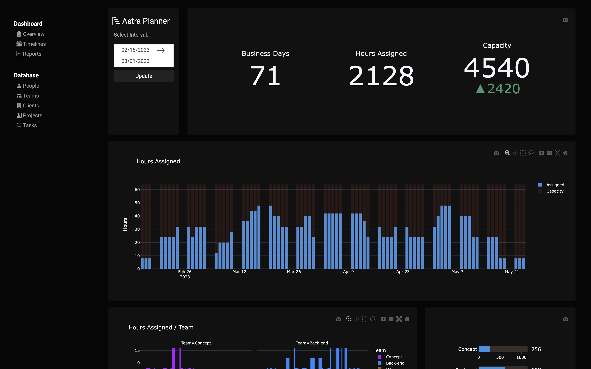
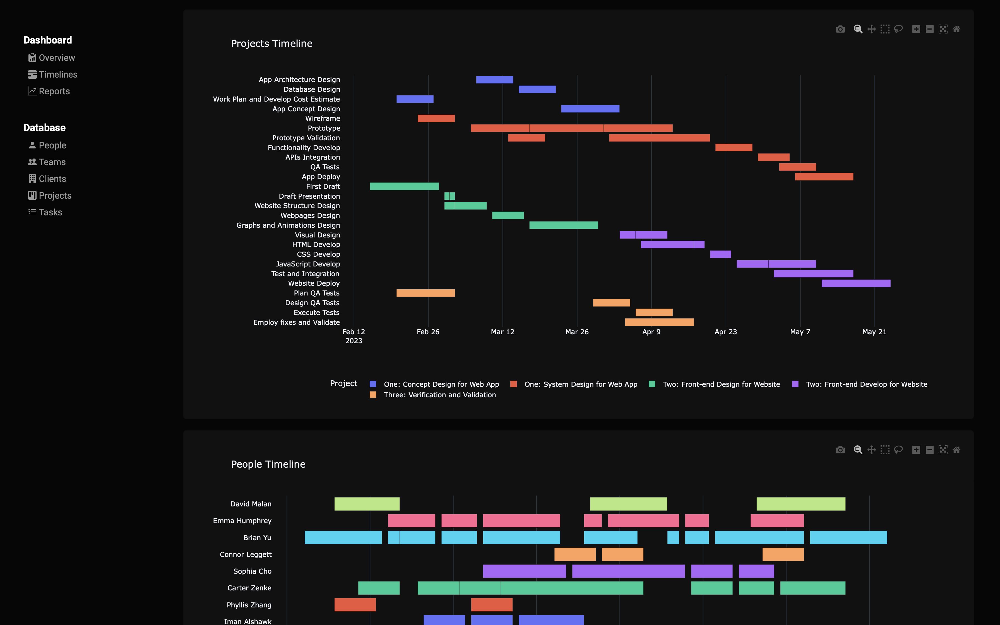
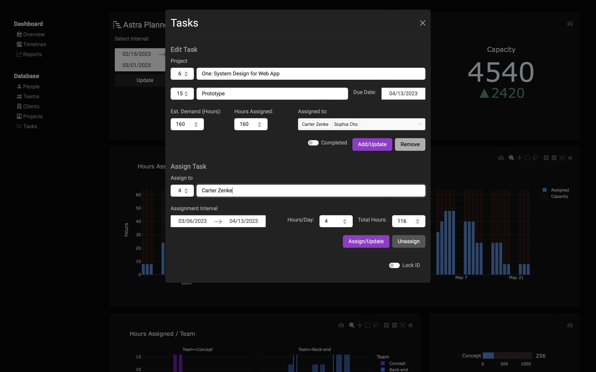

# **ASTRA PLANNER**
### Description:

Astra Planner is a resource management web application for capacity planning and forecasting across teams, projects and tasks.

Astra was built using the Dash Framework, along with Pandas for data analysis and Plotly.js for charting. For storing data, Astra uses a sqlite database. All the database changes are handled through form modals and callback functions.

The dashboard shows some useful graphs and indicators which are automatically updated along database changes.

The modals offer options to add, update or remove registers. All the callback functions check for valid inputs to guarantee database integrity. The unique ID fields are read only, as well as the calculated fields.

